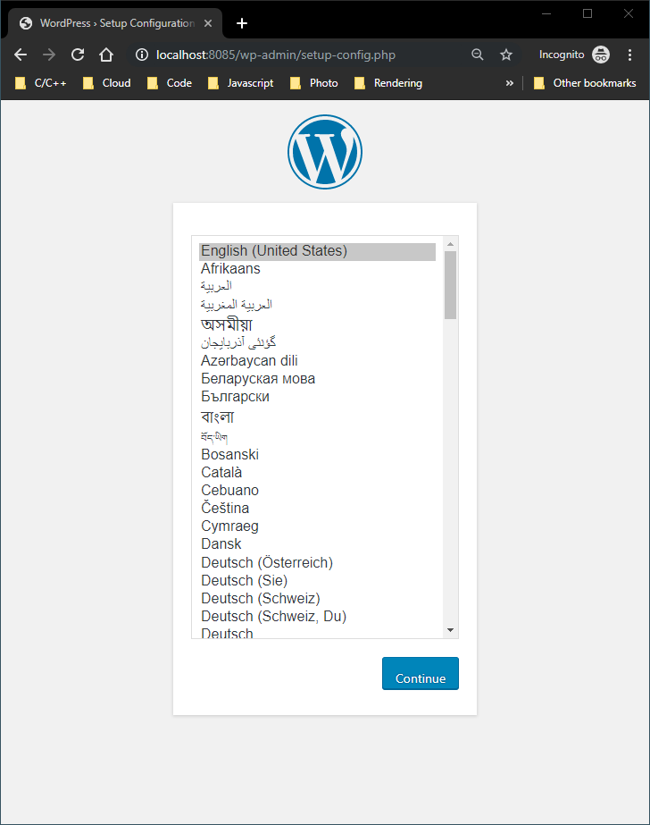

# Containers 101

## Installing Docker

Follow the instructions for your host OS:

* [Windows](https://docs.docker.com/docker-for-windows/install/)
* [Mac](https://docs.docker.com/docker-for-mac/install/)
* [Ubuntu](https://docs.docker.com/install/linux/docker-ce/ubuntu/)
* [CentOS](https://docs.docker.com/install/linux/docker-ce/centos/)
* [Debian](https://docs.docker.com/install/linux/docker-ce/debian/)
* [Fedora](https://docs.docker.com/install/linux/docker-ce/fedora/)

## Running our first container

Once Docker is installed, lets dive into creating our first container by executing the following command in a CLI of your choice.

```bash
docker run hello-world
```


You will most likely need internet connectivity in order to execute this command


The command should output something along these lines:

```bash
Hello from Docker!
This message shows that your installation appears to be working correctly.
...
```

Yay! Congratulations, you've just created your first container. Albeit a very simple one, we'll be correcting that very soon.

## Terminology

Let's understand some of the commonly used terminology before we dive into deeper waters:

* **Images** - An image is a file, comprised of multiple layers, used to execute code in a container. Think of this as the blueprint that is used to run a container from.
* **Layers** - Docker images are designed to be composed of a series of layers.
* **Containers** - A container is an instantiation of an image. Specifically speaking, docker containers are created by adding a top writable layer along with an image \(since images are a collection of layers themselves, adding one or few is not an issue at all\).
* **Volumes** - By default all files created inside a container are stored on a writable container layer. This data is not persistent. In cases when data has to be injected, or persisted, a volume can be used to map to a path in the container.
* **Ports** - By default, when you create a container, it does not publish any of its ports to the outside world. In order to facilitate communications with the outside world, ports can be opened on the container.
* **Environment Variables** - Docker lets you store data such as configuration settings, encryption keys, and external resource addresses in environment variables that can be configured during the creation of the image.

## Docker Registry

A registry is a storage and content delivery system, holding named Docker images, available in different tagged versions.

For example, in the previous command we ran a container from the image `hello-world`. But our machines didn't have any asset named `hello-world` installed locally. If you noticed, when the command was executed, since the image could not be found locally, it was downloaded from the docker registry.

You can explore images in the docker registry [here](https://hub.docker.com/).

## Understanding container creation command

Let's try to run a new wordpress blog by running this command.

```bash
docker run --name docker-blog -p 8085:80 -d wordpress:apache
```

This should start the container running our new `wordpress` based `docker-blog`, and can be seen by visiting `http://localhost:8085` in your browser.



Lets look at some of the parameters of the docker run command:

* `-d`: run the container as a detached process \(in background\). Otherwise the container will run in foreground, i.e. the output will show in the CLI,
* `-p`: define a port that you would like to map between the container and the outside world. `-p 8085:80` means the container's port `80` can be accessed from outside on port `8085`,
* `--name`: give the container a human friendly name.
* `wordpress:apache`: this lists the name of the image to create the container from. The second part is the image's tag to use. If tag is missing, then `latest` is used by default. Think of image tag as synonymous to git tags.

## Some other useful docker commands

### Find which images are available locally

As we explained above, images are downloaded from docker registry when being used the first time. In case if you want to check which images are available on your machine, run this command:

```text
docker image ls
```

The output would look something like this:

```text
REPOSITORY          TAG                 IMAGE ID            CREATED             SIZE
alpine              latest              055936d39205        7 days ago          5.53MB
wordpress           apache              1a83b29041b7        8 days ago          424MB
wordpress           latest              1a83b29041b7        8 days ago          424MB
redis               latest              a4fe14ff1981        10 days ago         95MB
node                latest              a0d7a409d125        2 months ago        904MB
ubuntu              latest              47b19964fb50        3 months ago        88.1MB
hello-world			latest              fce289e99eb9        4 months ago        1.84kB
```

### Monitoring the condition of our containers

At times, we would like to see the status of containers and their state. In that case, run this command:

```text
docker ps -a
```

The output from the command would look like this:

```text
CONTAINER ID        IMAGE                COMMAND                  CREATED             STATUS              PORTS                  NAMES
f5abd858308d        wordpress:apache     "docker-entrypoint.s…"   4 minutes ago       Up 4 minutes        0.0.0.0:8085->80/tcp   docker-blog
```

* **CONTAINER ID** - this is the SHA1 name that's automatically assigned to container.
* **IMAGE** - this is the name of the image the container was created with.
* **COMMAND** - each image runs 1 \(and only 1\) command when it starts, this is that command.
* **CREATED** - how long ago the container was created.
* **STATUS** - the current status of the container.
* **PORTS** - the ports exposed by the container and their mappings.
* **NAMES** - the name of the container.

### Stop, start, restart containers

In case the container needs to be stopped, then execute this command:

```text
docker stop f5abd858308d
```


Whenever referencing a container, image or any other resource in docker commands, the **`ID`** or the **`name`** can be used for that resource.


If the container that is already created that needs to be started, then execute this command:

```text
docker start docker-blog
```

When a container needs to be rebooted, run this command:

```text
docker restart docker-blog
```

## Sample Images

* Base Images
  * Ubuntu
  * Alpine
  * CentOS
* Proxy Tools
  * [Traefik](https://traefik.io/)
  * nginx
* CI/CD
  * Jenkins
  * Drone
* Databases
  * Elasticsearch
  * Redis
  * Mongo
  * SQL Server
  * PostgreSQL
  * InfluxDB
  * Couchbase
* Monitoring
  * Grafana
  * Prometheus
  * Jaeger
* Messaging
  * RabbitMQ
  * Nats
* Swagger
* Wordpress
* Consul
* node
* Zookeeper
* ASP.NET Core
* .NET Core

